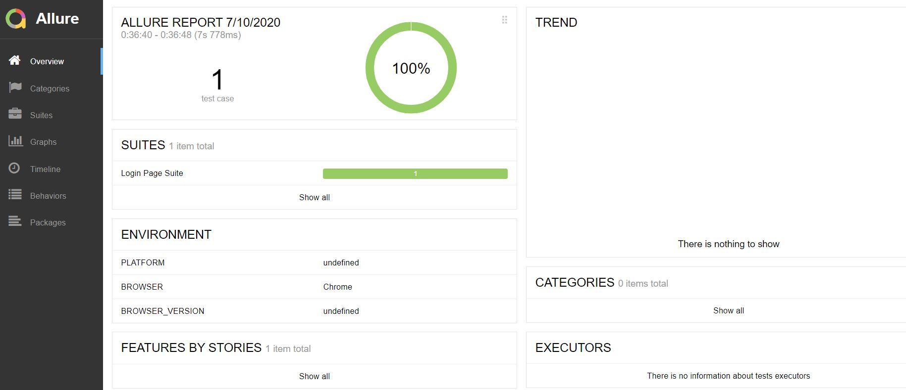
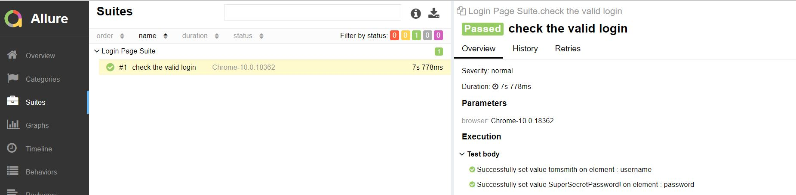

Simple and Ready to Use framework for UI automation using WebdriverIO, Mocha, Allure and TeamCity integration 

## Features
- WebdriverIO v6
- Page Object model
- Custom Actions and Verification Keywords using Mocha
- Allure Report
- Screenshot capture for failing tests
- ESLint
- Integration with Team City (In Progress)

## How to Start

**Download a release or clone the project**

**Install**

```npm install```

**Run Tests**

```npm test```

**Allure Report**
(you must have installed [allure command line](https://docs.qameta.io/allure/#_get_started))

```npm run report```

**Allure Report**




